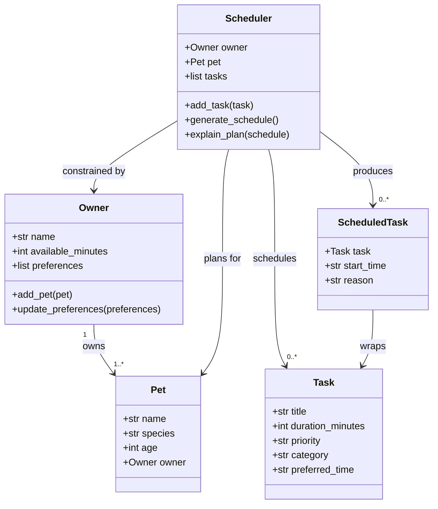

# PawPal+ Project Reflection

## 1. System Design

### Three Core User Actions
1. **Add a pet** — The user enters basic info about their pet (name, species, age) and themselves (name, time available per day).
2. **Add/manage care tasks** — The user creates tasks (e.g., morning walk, feeding, medication) with a duration, priority level, and preferred time of day.
3. **Generate a daily schedule** — The system builds an ordered daily plan that fits within the owner's available time, prioritizing high-importance tasks and explaining why each task was included.

---

### Mermaid UML Class Diagram

---

**a. Initial design**

The initial design uses five classes:
- **Owner** — holds the owner's name, total available minutes per day, and any scheduling preferences (e.g., "prefers morning walks"). It acts as the source of time constraints for the scheduler.
- **Pet** — holds basic pet info (name, species, age) and a reference to its owner. It is the subject of the care plan.
- **Task** — represents a single care activity with a title, duration, priority (low/medium/high), category (walk/feed/meds/grooming/enrichment), and a preferred time of day. Tasks are the raw inputs to the scheduler.
- **ScheduledTask** — a wrapper that pairs a Task with a concrete start time and a human-readable reason explaining why it was placed at that time. This is the output unit of the scheduler.
- **Scheduler** — the core logic class. It holds a reference to the Owner and Pet, maintains the list of unscheduled Tasks, and exposes `generate_schedule()` (builds the ordered plan) and `explain_plan()` (produces a narrative summary).

Relationships: An Owner owns one or more Pets. The Scheduler is constrained by the Owner's available time, plans for a specific Pet, consumes a list of Tasks, and produces a list of ScheduledTasks. Each ScheduledTask wraps exactly one Task.

**b. Design changes**

- Design changes will be documented here during implementation.

---

## 2. Scheduling Logic and Tradeoffs

**a. Constraints and priorities**

- What constraints does your scheduler consider (for example: time, priority, preferences)?
- How did you decide which constraints mattered most?

**b. Tradeoffs**

One tradeoff the scheduler makes is using **independent slot cursors** for each time slot (morning, afternoon, evening, anytime) rather than a single global timeline. This means two tasks from different slots can never conflict with each other in the generated schedule — the scheduler guarantees a clean plan by construction.

The tradeoff: the conflict detection method (`detect_conflicts`) is therefore most useful when tasks are added with *manually forced* start times, or when an external source injects tasks that bypass the slot-cursor logic. It will never fire on a schedule produced by `generate_schedule()` itself.

This is reasonable for a pet care app because the goal is a *practical, readable* daily plan, not a minute-perfect calendar. A pet owner benefits more from a guaranteed-clean schedule than from an exact global timeline that might raise spurious conflicts. If the app later supports time-locked tasks (e.g., "vet appointment at 10:15") the conflict detector will become critical.

---

## 3. AI Collaboration

**a. How you used AI**

- How did you use AI tools during this project (for example: design brainstorming, debugging, refactoring)?
- What kinds of prompts or questions were most helpful?

**b. Judgment and verification**

- Describe one moment where you did not accept an AI suggestion as-is.
- How did you evaluate or verify what the AI suggested?

---

## 4. Testing and Verification

**a. What you tested**

- What behaviors did you test?
- Why were these tests important?

**b. Confidence**

- How confident are you that your scheduler works correctly?
- What edge cases would you test next if you had more time?

---

## 5. Reflection

**a. What went well**

- What part of this project are you most satisfied with?

**b. What you would improve**

- If you had another iteration, what would you improve or redesign?

**c. Key takeaway**

- What is one important thing you learned about designing systems or working with AI on this project?
