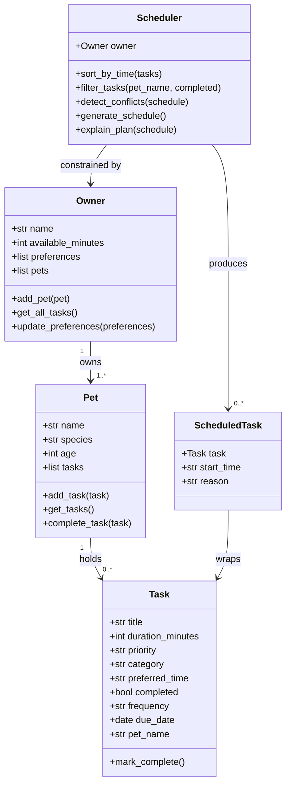

# PawPal+ Project Reflection

## 1. System Design

### Three Core User Actions
1. **Add a pet** — The user enters basic info about their pet (name, species, age) and themselves (name, time available per day).
2. **Add/manage care tasks** — The user creates tasks (e.g., morning walk, feeding, medication) with a duration, priority level, and preferred time of day.
3. **Generate a daily schedule** — The system builds an ordered daily plan that fits within the owner's available time, prioritizing high-importance tasks and explaining why each task was included.

---

### Mermaid UML Class Diagram

---

**a. Initial design**

The initial design uses five classes:
- **Owner** — holds the owner's name, total available minutes per day, and any scheduling preferences (e.g., "prefers morning walks"). It acts as the source of time constraints for the scheduler.
- **Pet** — holds basic pet info (name, species, age) and a reference to its owner. It is the subject of the care plan.
- **Task** — represents a single care activity with a title, duration, priority (low/medium/high), category (walk/feed/meds/grooming/enrichment), and a preferred time of day. Tasks are the raw inputs to the scheduler.
- **ScheduledTask** — a wrapper that pairs a Task with a concrete start time and a human-readable reason explaining why it was placed at that time. This is the output unit of the scheduler.
- **Scheduler** — the core logic class. It holds a reference to the Owner and Pet, maintains the list of unscheduled Tasks, and exposes `generate_schedule()` (builds the ordered plan) and `explain_plan()` (produces a narrative summary).

Relationships: An Owner owns one or more Pets. The Scheduler is constrained by the Owner's available time, plans for a specific Pet, consumes a list of Tasks, and produces a list of ScheduledTasks. Each ScheduledTask wraps exactly one Task.

**b. Design changes**

Two significant changes were made during implementation:

1. **Owner now holds pets; Pet now holds tasks.** The initial design had the `Scheduler` holding a flat list of tasks directly. During implementation it became clear that tasks naturally belong to a specific pet, and pets naturally belong to an owner. Moving the lists into their logical owners made filtering by pet trivial and kept the Scheduler focused purely on scheduling logic.

2. **Task gained `frequency`, `due_date`, and `pet_name` fields.** The initial Task was a simple snapshot. When recurring tasks were added, `mark_complete()` needed to know the recurrence cadence and the pet it belongs to so the next instance could be created with the correct metadata. These three fields were added to support that without changing any other class.

---

## 2. Scheduling Logic and Tradeoffs

**a. Constraints and priorities**

The scheduler considers two hard constraints and one soft hint:
- **Time budget** (hard) — no task is added to the schedule if it would push total minutes used past `owner.available_minutes`. This was the most important constraint because it models the real-world limit every pet owner faces.
- **Priority** (hard ordering) — tasks are sorted high → medium → low before time-fitting, so if the budget runs out, low-priority tasks are dropped first.
- **Preferred time slot** (soft hint) — each task carries a `preferred_time` ("morning", "afternoon", "evening", "anytime"). The scheduler places tasks into the matching slot cursor rather than a single global clock. This keeps the plan readable without requiring the owner to specify exact times.

Time budget was treated as most important because violating it makes the schedule physically impossible. Priority was second because it determines *which* tasks survive when the budget is tight. Preferred time is soft because the app should still produce a usable plan even when time preferences conflict.

**b. Tradeoffs**

One tradeoff the scheduler makes is using **independent slot cursors** for each time slot (morning, afternoon, evening, anytime) rather than a single global timeline. This means two tasks from different slots can never conflict with each other in the generated schedule — the scheduler guarantees a clean plan by construction.

The tradeoff: the conflict detection method (`detect_conflicts`) is therefore most useful when tasks are added with *manually forced* start times, or when an external source injects tasks that bypass the slot-cursor logic. It will never fire on a schedule produced by `generate_schedule()` itself.

This is reasonable for a pet care app because the goal is a *practical, readable* daily plan, not a minute-perfect calendar. A pet owner benefits more from a guaranteed-clean schedule than from an exact global timeline that might raise spurious conflicts. If the app later supports time-locked tasks (e.g., "vet appointment at 10:15") the conflict detector will become critical.

---

## 3. AI Collaboration

**a. How you used AI**

AI (Claude Code) was used in three distinct ways across this project:

- **Design brainstorming** — describing the scenario and asking "what classes should this system have and what are their responsibilities?" produced a clean first-draft UML that matched the domain well.
- **Scaffolding** — generating dataclass skeletons from the UML description saved significant boilerplate time and kept all classes structurally consistent from the start.
- **Incremental feature implementation** — each new feature (recurring tasks, conflict detection, sort/filter) was built by describing the goal in plain English and then reviewing and testing the generated code before accepting it.

The most helpful prompt pattern was: *"Given this existing class structure [paste code], implement X so that it [describe exact behavior]."* Concrete behavioral descriptions produced much cleaner code than vague feature requests.

**b. Judgment and verification**

When the conflict detection method was first generated, it used a single global timeline and raised conflicts on the *generated* schedule — which was confusing because the scheduler was already placing tasks sequentially. The AI suggestion was rejected in favor of the slot-cursor design, which guarantees a conflict-free generated schedule and reserves `detect_conflicts()` for externally-injected or manually-forced start times.

Verification was done by writing a dedicated test (`test_generated_schedule_has_no_conflicts`) that runs `generate_schedule()` and asserts the conflict list is empty, and a separate test that manually constructs overlapping tasks to confirm the detector still fires when it should.

---

## 4. Testing and Verification

**a. What you tested**

21 tests cover eight behavior areas: task completion and exclusion from schedule, daily/weekly/once recurrence, `pet.complete_task()` re-queuing, `pet_name` stamping, empty-pet edge case, cross-pet task aggregation, chronological sort order, filter accuracy by pet and status, time-budget enforcement, priority ordering, conflict detection (overlap, exact same time, sequential, generated schedule). These were important because the scheduling rules have several interacting parts — a bug in priority ordering or time-budget enforcement would silently produce a wrong plan, not a crash.

**b. Confidence**

**★★★★☆** — All documented happy paths and the main edge cases pass. Confidence is high for the core scheduling loop. Gaps: tasks that span the midnight boundary, owners with zero pets, very large task pools near the time limit, and tasks with manually set start times that conflict across different preferred-time slots. These would be the next tests to write.

---

## 5. Reflection

**a. What went well**

The clearest success was the decision to keep scheduling logic entirely in `pawpal_system.py` and treat `app.py` as a pure display layer. Because the two layers were separated from the start, it was straightforward to test all scheduling behavior independently of Streamlit, and connecting the UI was mostly mechanical wiring rather than logic work.

**b. What you would improve**

The time-slot cursor system works well for a simple daily planner but would not scale to a real calendar app. In a future iteration, tasks would carry an explicit `start_time` field, and the scheduler would operate on a single global timeline with minute-level precision. This would make the conflict detector genuinely useful for the generated schedule and allow features like vet appointment slots and fixed feeding windows.

**c. Key takeaway**

The most important lesson was that AI tools are most valuable when you act as the **lead architect** — you set the structure, define the behavioral contracts, and verify correctness through tests. When AI was given a clear structure and a specific behavioral description, it produced clean, usable code quickly. When it was given vague goals, it made architectural decisions that had to be undone. The human's job is to decide *what* the system should do and *how it should be structured*; AI's job is to fill in the implementation details quickly.
